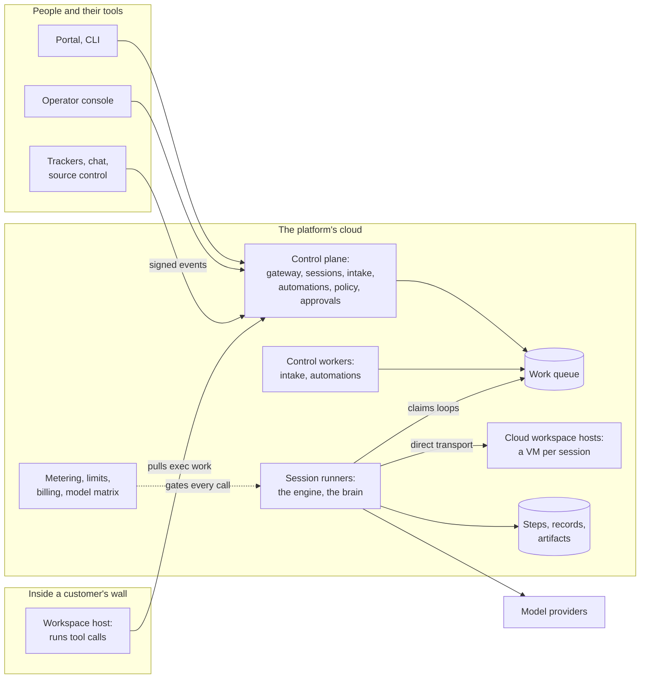

# A Platform for Closed-Loop Agent Fleets

*`distro_gentic`, a specification of a closed-loop, cloud-first,
distributed agentic platform. A personal edition, preliminary.*

An engine runs an agent. A platform runs a fleet of them: for many
tenants, unattended, for days at a time, on machines it does not always
own. And it **closes the loop**: work arrives on its own, evidence goes
out, and the world's answer comes back into the same session. This spec
says what the parts of such a platform are and what they guarantee, and
why. The how belongs to its scaffold and its lenses ([The
Repository](#the-repository)).

## How to Read This

The conventions are [`agentic_core`'s How to Read
This][e-read]: section tags in the
guideline's sense, present-tense rules, **Principle** boxes, *Example*
lines that illustrate and never add a rule, and `agents-only` comments
for nuance only an agent needs.

`distro_gentic` stands on two foundations and repeats neither:

- **The guideline**, [`swe_guidelines`][g]: general software design. The
  object model, interfaces, context, storage and its roles, the work
  queue and workers, the gateway, realtime, twins, deployment, and
  operations.
- **The engine**, [`agentic_core`][e]: steps,
  sessions, context, models, tools, policy, the runtime interfaces,
  streams, steering, identity, agent kinds, budgets, parking, and
  privacy.

This spec says only what a platform adds.

## The Core

These are the invariants. Each links the section that states it.

- [A loop is closed by evidence and returning
  feedback](#what-closes-a-loop), and the platform enforces it.
- [The brain runs in the platform's cloud, always](#session-runners); a
  runner never runs inside the sandbox it drives.
- [Hosts pull; the platform never calls into a customer's
  wall](#workspace-hosts), and a host advertises only what it probed.
- [Isolation is pinned, probed, and refused](#pinned-probed-refused).
- [Every execution is a record with its version and
  provenance](#execution-records), and [work completes through one
  gate](#the-result-gate).
- [Executor, principal, spender, and actor are four
  answers](#four-identities).
- [A secret is resolved where it is used](#secrets-by-placement), and a
  cloud secret never crosses a customer's wall.
- [One ledger and one price source](#one-price-source), failing closed.

## Contents

- [The Running Example](#the-running-example)
- [What Closes a Loop](#what-closes-a-loop)
- [At a Glance](#at-a-glance)
- [Sessions Are Work](#sessions-are-work)
- [Session Runners](#session-runners)
- [Placement and Workspace Hosts](#placement-and-workspace-hosts)
- [Workspaces and Isolation](#workspaces-and-isolation)
- [Watching and Steering](#watching-and-steering)
- [Work In, Results Out](#work-in-results-out)
- [Evidence](#evidence)
- [Trust](#trust)
- [Money](#money)
- [Models Are a Fleet Decision](#models-are-a-fleet-decision)
- [The Agents a Platform Ships](#the-agents-a-platform-ships)
- [Data, Retention, and the Wall](#data-retention-and-the-wall)
- [Failure at Fleet Scale](#failure-at-fleet-scale)
- [Operations](#operations)
- [Deviations from the Guideline](#deviations-from-the-guideline)
- [The Repository](#the-repository)
- [What This Spec Does Not Cover](#what-this-spec-does-not-cover)
- [Next: Rodeo](#next-rodeo)

## The Running Example

> A team files a ticket: *"The checkout service sometimes drops a
> request under load. Investigate and fix it."* An automation turns it
> into a session pinned to the team's host pool, because its builds and
> devices must stay there. The agent's loop runs in the platform's cloud;
> its tool calls run on a workspace host in that pool. At 2 a.m. a model
> provider fails; two hundred sessions park within a second and resume
> when it recovers. By morning the session has a pull request, a report
> citing every run behind its claims, and a cost to the cent. A
> reviewer's comment wakes it again before lunch.

## What Closes a Loop

`core`

An agent that writes a fix and stops has done half the job. A loop is
closed when the evidence of each action picks the next one, and when the
world's answer to the result comes back into the same session. A failed
test is the input of the next iteration, not a report to a person. A
review comment reopens the work; it never starts a conversation that has
forgotten the old one.

A platform claims a closed loop only if it keeps seven promises:

1. **Every execution is recorded,** durably, tied to the version and
   the environment it ran in. Hypotheses and findings are records too,
   and the plan is a projection of the agent's steps, never chat.
2. **A baseline comes first,** recorded before a change, so "fixed" has
   something to be compared with.
3. **Work completes through one gate,** which refuses a success unless
   the project's validation passed at the exact version delivered, with
   the runs behind each claim cited.
4. **Failed and inconclusive are first-class.** A failure with an
   evidence-backed explanation is a result; a success without validation
   is not.
5. **Feedback returns** to the same session after delivery.
6. **Success is judged by behavior,** against checks the agent cannot
   weaken; acceptance and benchmarks add checks it cannot see.
7. **Autonomy stops exactly where policy says:** at an approval, a bound,
   or a limit.

> **Principle:** A loop is closed when evidence picks the next step and
> feedback returns to the same session. A platform enforces it; it never
> just hopes for it.

## At a Glance

| Plane | Parts | Where it runs |
|---|---|---|
| **Control** | The gateway, sessions, intake and routing, automations, policy, approvals, realtime; the control workers | The platform's cloud |
| **Brain** | Session runners hosting the engine: model calls, the history, the budget gate | The platform's cloud, always |
| **Hands** | Workspace hosts and the workspaces they hold | The platform's cloud, or inside a customer's wall |
| **Records and money** | Steps, execution records, artifacts; metering, limits, billing, the model matrix | The platform's cloud |

Every connection that crosses a customer's wall is opened from inside
it.

## Sessions Are Work

### Kinds of Work

A session always lives in the control plane, whatever machine runs its
commands. To make progress it becomes work, a row of the guideline's
[work queue][g-workq]. What is agentic is that one session produces
several kinds of work, and each must run where its environment is:

| Work | Runs on | Claimed from |
|---|---|---|
| `loop`: run or resume a session's loop | Any session runner | The loop lanes |
| `exec`: a tool call relayed into a customer's wall, or a person's command in any workspace | The host that holds the workspace | That host's lane |
| `workspace`: prepare, release, purge | A host in the session's placement | The placement's lane to prepare; the holding host's to release or purge |
| Platform work: intake, automations | Control workers | Their own lanes |

A lane is the guideline's work-item lane, so every kind is one queue
with one shape. A runner claims from the queue directly; a host
outside the cloud claims through the gateway, and the control
plane claims the row on its behalf. A tool call to a cloud workspace
needs no item: the runner reaches it by the direct transport.

A product built on the platform adds kinds of its own, each with its
lane and the claimant that takes it through the gateway. The platform's
kinds are registered the same way, and a claimant takes only its own.

### Fair Share

Loops are long and expensive, so the platform shares them by the
guideline's means. Loop work runs in a lane per plan tier, and a tenant
whose bulk work still crowds its neighbours gets a lane of its own
([Scalability by Design][g-scale]). Each tenant also has a concurrency
limit, enforced as a guard at the claim: a claimed loop over its
tenant's limit goes back to its lane with a delay and spends no attempt.
The claim order within a lane stays the guideline's.

## Session Runners

`core`

A **session runner** is a worker role ([Worker Roles][g-workers]) that
claims `loop` work and hosts the engine while it runs a session's loop.
It holds nothing that cannot be rebuilt from storage, so any runner
resumes any session; a session's first run and its second, a week
later, rarely share a machine.

- **The brain runs in the platform's cloud, always.** Model keys, the
  history, and the budget gate never leave it. A runner never runs
  inside the sandbox it drives.
- **Agent kinds live in the platform.** They are defined, versioned, and
  policy-checked there; no host carries one, and no customer install
  runs its own.
- **A lost claim stops its writes.** A runner holds its lease as every
  worker does ([Shape of a Worker][g-worker]); the engine adds the
  writer epoch, which refuses a stale run's steps and commands
  ([`agentic_core` Durable by
  Default][e-durable]).

A runner chooses the transport by the session's placement: a **direct
transport** to a cloud workspace, or a **relay transport** to a host
inside a customer's wall ([The Relay Transport](#the-relay-transport)).
The engine sees one transport interface either way.

> **Principle:** The brain runs in the platform, and a lost claim stops
> a runner's writes, whatever its clock says.

## Placement and Workspace Hosts

### Placement

**Placement** is part of a session: the cloud pool, or a customer's
**host pool** (one or more hosts inside their wall that share labels),
in a region. A session pinned to a host pool waits, visibly, while no
host in the pool is online. It never moves to the cloud unless a
principal changes its placement, because a team pins a machine for a
reason: a device, a license, a build that must stay local.

Placement keeps the checkout, the builds, the devices, and the secrets
inside the wall, never the content the model reads. Every tool result,
source code included, is stored in the platform's history and sent to
the model provider. A tenant that must keep some content inside declares
read deny-lists, which its hosts enforce before a result leaves, and
resolves only to fills eligible for its policy.

### Workspace Hosts

`core`

A **workspace host** prepares workspaces and runs tool calls in them.
The platform runs a pool of them in its cloud, and a customer installs
the same program inside their wall. A host outside the cloud is a client
of the gateway, like the CLI, never a process of the platform's
deployment. It opens every connection outward; the platform never calls
in.

- **Its own credential.** A host enrolls once with its organization's
  enrollment token and receives a short-lived, rotating credential of a
  kind and prefix of its own ([The Gateway][g-gateway]). That is the
  executor identity ([Four Identities](#four-identities)).
- **Versioned work.** `exec` work is a public wire type, versioned
  like any other ([Public Types][g-public]). A host states its
  version at every claim, and one below the supported floor is refused,
  since a customer upgrades on its own schedule.
- **Probing.** At startup a host checks that it reaches what it needs
  (its trust store, its proxy, the platform, a sane clock), so a
  misconfigured host fails at startup, never mid-session. It advertises
  its operating system and shell, its capabilities, and only the
  isolation modes it probed, because an overclaimed mode silently
  weakens the sandbox of every session that trusts it.
- **Pinned claims.** A host is handed only the work pinned to its pool,
  filtered by its identity, never by what it asks for.
- **Owner's ceilings.** A host enforces limits its owner sets and the
  platform cannot raise: the projects it serves, its minimum isolation,
  its egress, the paths it lets a result read, and whether it accepts
  people's commands. A compromised control plane still cannot widen what
  a host does.
- **What it holds.** No database credential, no model key, no history:
  its own credential, its local secret store (keyed by tenant first, as
  every secret is), and the files of its workspaces. The one credential
  the platform issues it is a push token minted per session, short-lived
  and scoped to the session's branch, never the integration's own
  credential.
- **Workspace binding.** A workspace lives on the host that prepared it,
  so its `exec` work goes to that host's lane. A host that is lost takes
  its workspaces with it, since a workspace is a cache, and the next
  loop prepares another in the same pool.

### The Relay Transport

A tool call into a customer's wall travels as `exec` work:

1. The engine's tool call becomes an `exec` item whose id derives from
   the tool request's idempotency key ([Identifiers][g-ids]). It carries
   the command or file operation, the tool's effect, the deadline, the
   writer epoch, and the session's isolation spec.
2. The host claims it under a lease, runs it through its local
   transport, and streams output parts back.
3. The host pushes the result, and the control plane stores it under
   the key.
4. The runner writes the `tool_response` from that result.

A host also holds one long-lived outbound stream to the control plane,
which carries wake-ups, cancels, interrupts, deadline cuts, and lease
revocations, so a command starts at once and stops at once. The work row
stays the record. A person's terminal is a recorded terminal session over
the same stream, never a remote desktop.

Because an item is keyed, a run that resumes after a crash attaches to
the first execution, or reads its stored result, and never starts a
second one. An item whose lease expires is requeued only when its effect
is `read_only` or `idempotent`, and only to the host that holds its
workspace; an `unsafe` one completes `interrupted`, outcome unknown.

> **Principle:** Hosts pull; the platform never calls in. A host
> advertises only what it probed, claims only what is pinned to it,
> holds its owner's ceilings, and never repeats an unsafe call.

## Workspaces and Isolation

### A Workspace Is a Cache

A **workspace** is the checkout the tools work on: a session branch,
inside the instance a host prepared. The branch, its commits, and the
artifacts live elsewhere. After a loop, the instance stays warm for a
short grace so a follow-up can reattach; then it is released. It is
released at once when the session is archived or cancelled. A session
that merely exists holds no machine.

Before an instance is released, uncommitted work is committed to a
snapshot ref and pushed, and the next loop is told about it. When a
session's branch has vanished, the platform rebuilds it only when it
knows why (a merged or closed pull request). Anything else fails loudly;
nothing restarts silently from the default branch.

### Isolation Levels

`default`

| Level | Separates | Typical use |
|---|---|---|
| A microVM or VM per session | Filesystem, processes, network, and kernel, across sessions and tenants | The cloud's level |
| A container per session | Processes and filesystem; the host kernel is shared, unless a user-space kernel stands between | Validation executors; a customer's laptop |
| A directory on the host | Only what a dedicated user and the directory separate | Work that needs the host itself: GUI tools, GPU drivers |
| A twin | Nothing; it plays the lifecycle for tests and says so | `local` only |

### Pinned, Probed, Refused

`core`

A session's isolation is pinned when it is created and enforced by the
host. A host that cannot provide it refuses the `workspace` work before
the loop's first model call, and the loop parks on `resource` until a
host in its placement can. Every level runs from a process environment
stripped of every platform credential. The cloud never runs a session
directly on a shared host, and a bare directory exists only inside a
customer's wall.

A bare-directory workspace runs as a dedicated, unprivileged user that
cannot read the host's credential, its secret store, or another
workspace. A host that cannot enforce the session's egress for that user
refuses the session, as it refuses any isolation it cannot provide.
Concurrency follows isolation: a host that offers only a bare directory
runs one session at a time, unless its owner says otherwise.

### Egress

A workspace's egress opens outward only, to a per-project allowlist that
names destinations and methods: source control, through a credential
scoped to the session's branch; package registries, read-only,
through a vetting mirror; the platform's endpoints. Open egress is an
explicit policy choice, recorded. A workspace never reaches the
platform's internal network or a cloud metadata endpoint. No surface
renders a URL from agent output as a fetch, such as an image in a
comment or a mirror.

> **Principle:** A workspace is a cache of durable state. Isolation is
> pinned, probed, and refused; never weakened. Egress is an allowlist of
> destinations and methods.

## Watching and Steering

### Live Streams

The engine streams everything ([`agentic_core`
Streams][e-streams]); the platform carries it on two
paths:

- **The realtime channel** carries every change as the guideline's hint
  and record ([Realtime at the Edge][g-realtime]): a stream opened or
  completed, a status changed, a loop started or ended.
- **The live read** carries content, and it is a read, never a push. A
  viewer is handed a short-lived, scoped handle, the way a browser app is
  handed a presigned URL ([Client Rendering][g-client]), and reads an
  open stream from the part it last saw.

A live part is a cache whose loss costs nothing, because the step or
artifact it adds up to is the record. The stream service holds a bounded
buffer per open stream, which is all the state a lightly stateful service
may hold ([Stateless vs Stateful Services][g-stateful]). A late viewer of
an artifact reads its bytes so far; a late viewer of a model stream sees
the buffered tail. A video stream is an index of encoded segments, and a
slow viewer drops the oldest, never the newest. The live view is a
window onto the evidence, never a second world beside it.

### Steering

A message from the portal, the CLI, or a chat surface reaches the
session's inbox over the API, and the engine delivers it at its next
model call ([`agentic_core` Steering][e-steering]). A
chat message counts as a principal's only when a chat user mapped to a
platform user addresses it to the agent; everything else relayed from
chat is data.

### Take Control, Give Back

Sometimes a person needs their hands on the work. They **take control**:
the agent stands down, its loop parked on a hand-over, and the session,
its workspace, and its evidence stay as they are. The person's commands
run as `exec` work on the host that holds the workspace, through the
same transport and the same stripped environment, recorded as runs
attributed to that person. When they **give it back**, their summary
becomes a message the agent reads on resume. A remote desktop would give
the person everything and the platform nothing: no record of what ran,
by whom, with what result.

### Mirrors

`optional`

A session's progress may be mirrored into another product's agent
surface, such as an issue tracker's: thoughts, actions, questions, and
the outcome, coalesced and throttled. A mirror subscribes to the stream.
The session never waits on it and never depends on its being reachable.

## Work In, Results Out

### Intake

External events arrive through the guideline's inbound queue
([Queues][g-queues]); the platform adds the routing.

### Feedback Routing

An event finds its session by the pull request, the branch, or the
session id it names. Only some feedback wakes the agent:

| Arrival | Effect |
|---|---|
| A principal's message | Wakes; unarchives an archived session |
| A comment on the agent's work by a mapped user who may instruct the session | Wakes, as that principal's message |
| Any other person's comment | Wakes, as data |
| A ticket reopened or reassigned to the agent | Wakes |
| A bot's comment, a line of CI output | Waits in the inbox, read at the next model call |
| A failing check | Wakes |
| A passing check | Waits |
| A person's push to the agent's branch | Hands the session over: the agent stands down rather than fight them |
| Anything for an archived session | Recorded only |

### Twins and Provenance

Every integration has the guideline's twin, which names its provenance
on every record and refuses to run outside `local` ([Twins for External
Services][g-twins]). Gating suites run twins and the scripted model
provider. Acceptance and benchmarks run as a non-gating job, as the
guideline's own benchmark does: integrations as twins, the model on real
providers. The platform carries provenance one step further, into
evidence ([Execution Records](#execution-records)).

### Automations

**Automations** turn events into bounded work. A trigger, an event with
filters or a schedule, leads to an action: start a session, or message a
standing session (a CI triage session, say). A product adds actions of
its own, each with a check that says when the work it started ended, so
its run stays at work until then. An automation runs as its
creator or as the tenant's automation principal, and has limits of its
own: a cost cap, a rate, a concurrency, and whether to queue when
limited. An automation ignores the events its own sessions caused,
unless it declares otherwise, and a chain of automations stops at a hop
limit, so an agent's comment cannot start an endless chain. Every firing
is a recorded run.

### Playbooks and Knowledge

**Playbooks** are a team's procedures as versioned, executable briefs:
what is needed, the steps, the safety requirements, the approval gates,
the success measures, and what is forbidden. They follow the [Agent
Skills](https://agentskills.io/specification) format, with their gates
in a namespaced metadata extension, so a brief runs in any agent that
reads the standard. Only a person publishes a playbook. A principal or
an automation invokes one, and its gates compile into the session's
policy, where they can only narrow it.

**Knowledge** is recalled into a session when its trigger matches, so a
new session does not rediscover its environment. It renders as data. An
agent may suggest knowledge, and a person reviews it before any session
recalls it, so one session cannot plant instructions for the next.

### Notifications

A park that needs a person notifies whoever can clear it (the requester,
eligible approvers, a budget's owner) on their channels, with a link to
the one action that clears it.

> **Principle:** Only some feedback wakes the agent, and only a principal
> instructs it. A playbook narrows policy; knowledge a person has not
> reviewed is never recalled.

## Evidence

The result is not the work product. It is the evidence that the work
product does what was asked, at the version delivered.

### Execution Records

`core`

Every execution is a record: the version it ran against, whether the
tree had uncommitted changes, the environment (an image digest, the
toolchain), the host and isolation it ran under, the check and its
version, its parameters, metrics, timing, outcome, and its artifacts,
each with a hash and a provenance. Every dependency an execution relied
on carries a **provenance**: `real`, `twin`, `double` (a test double), or
`unavailable`. A double is never validation, and twin evidence is never
reported as real. Hypotheses and findings are records too, each linked
to the runs that support or refute it.

### Validation Policy and Protected Checks

Each project declares a **validation policy**: which checks must pass, at
what grade, for which kinds of change, for a success to count. The
checks, their fixtures, the policy itself, and every path that changes
how tests are found or how the runtime starts are **protected**, by
pattern: the agent cannot edit them, and a change that touches one voids
validation.

Validation never runs in the agent's workspace. It runs on a fresh
executor, from the delivered commit, with the checks, fixtures, and
runner taken from the protected source, under an environment the agent
did not set. The executor writes and hashes the results, and the gate
accepts only results whose provenance names it.

A **baseline** of the same checks is recorded at the base version before
any change. For an intermittent defect, the baseline reproduces it at a
measured rate. A check nobody ran is a claim, not evidence, as the
guideline says of a negative control ([Tests][g-tests]).

### Statistical Evidence

`core`

Intermittent behavior needs repeated trials, and a rate is never shown
to be zero, only bounded. A claim about a rate reports a one-sided exact
or Wilson bound at a declared confidence, never a normal approximation,
which collapses at zero failures. The trial count, or a sequential test
valid under optional stopping, is declared before the trials. The gate
counts every trial at that version, and an aborted trial is classified
by a declared rule, never dropped. Candidate and baseline trials
interleave on the same host, and a claim across many scenarios
corrects for the number of comparisons.

<!-- agents-only
With zero failures in n trials, the one-sided 95% upper bound on the
rate is about 3/n, so bounding a rate below 1% takes about 300 clean
trials.
-->

### The Result Gate

`core`

Work completes through one gated tool ([`agentic_core` Done Rules and
the Result Gate][e-gate]).
It records the outcome (succeeded, failed, or inconclusive), the report,
the uncertainties, and the runs each claim cites. It refuses a success
that changed the work product unless the validation policy passed at the
committed head, with a clean tree, on results its executor wrote. A run
that validated nothing gets no exemption; it is inconclusive.

### The Results Contract

The platform defines the protocol, never the runner. A check is
declared: a command template, its kind, the capabilities it needs, and
the version of the results schema it writes. A run writes a strict,
versioned results file and streams its cases as they finish. A
compatibility check refuses a run before anything runs. One
collector serves every place a check can run.

### Acceptance and Benchmarks

**Acceptance** judges an agent's work the same way. The objective hides
its root cause. A hidden suite must pass beside the visible one, and the
result is judged by behavior, so any valid fix passes. Editing the
checks or the system under test is forbidden and checked. No surface the
agent reads (prompts, knowledge, tool sources, evidence, pull requests)
mentions the hidden suite, and a scanner checks every one. The harness
judges the chain of evidence (a failing baseline, the runs, the
hypotheses resolved, a clean validation, a cited report), never the
presence of files.

**Benchmarks** follow from it: preserved runs, judged scores, their cost,
and regressions flagged against a baseline, each pinned to the fill set
and agent-kind version that produced it.

> **Principle:** The result is the evidence. Validation is declared,
> protected, run apart from the agent, and checked at the version
> delivered.

## Trust

### Four Identities

`core`

The engine names the actor on every step, the principal on inputs and
tool calls, and the spender on model requests ([`agentic_core` Who Is
Who][e-who]). The platform adds the machine,
and keeps four apart. Confusing any two is a defect.

| Identity | What it is | Example |
|---|---|---|
| **Executor** | A machine's credential | A workspace host's key |
| **Principal** | On whose behalf, and with what authority | The person who asked; an automation's creator; a service principal the tenant granted |
| **Spender** | Who pays for a model call | The author of the latest principal input the model received |
| **Actor** | Who acted | The engineer agent in one session; a person; the engine |

An audit entry shows all four, so "which agent did this, for whom, paid
by whom, on which machine" has four answers. The agent holds no
authority of its own, and the plumbing runs under the context the
guideline's claim builds ([The Work Queue][g-workq]). So a session whose
creator left the tenant
is still recovered, and if its steady principal is no longer valid, its
tool calls park until a person assigns another.

A person's approval from chat counts only when the person clicking maps
to a platform user holding the approve permission, and it is audited as
that user.

### Untrusted by Default

Text from outside is data ([`agentic_core` Only a Principal
Instructs][e-principal]). A comment,
an issue, a chat message relayed by an integration reaches the agent
quoted and labelled, never as an instruction: the engine renders it so,
and the platform sets its origin. A principal speaks only through the
portal, the CLI, the API, an automation, or a mapped user addressing the
agent in chat or on its work.

### Secrets by Placement

`core`

An environment secret is declared by name on a project, with the
variable a command sees and a scope. The platform stores names
only. Where it can, the executor brokers the secret outside the
workspace; otherwise the machine that executes the call resolves it from
its own store, short-lived and scoped, injects it into that one process,
redacts it everywhere, and audits its use by name ([`agentic_core`
Secrets Never Enter a
Step][e-secrets]). A cloud secret
never reaches a customer's host; the per-session push token is minted
for it ([Workspace Hosts](#workspace-hosts)). A workspace never holds a
platform credential.

### The Tenant's Provider Keys

`optional`

A tenant's own provider key is a secret too. Each rotation mints a new
reference, so a client cached by reference never serves a rotated key. A
key is probed when it is saved. The tenant sees who added it and when it
was last used, never its value. A refused key parks the sessions that
need it.

### Exfiltration

The rule of two ([`agentic_core` Bound What a Convinced Model Can
Do][e-convinced]) is
enforced by policy, never hoped for. The platform sets the untrusted
mark from the origin of what a session reads, and the egress allowlist
([Egress](#egress)) is what makes "beyond its allowlist" checkable. A
session's own branch and its pull request on the tenant's bound
repository are its work product, never an outward write.

### Operator Access

An operator reads a tenant's sessions only through the operator plane,
naming the tenant ([The Operator Context][g-operator]). Opening a
session's content takes an operator permission of its own, which `read`
never implies, so shape is an operator's to read and content is not, by
default.

> **Principle:** Executor, principal, spender, and actor are four
> identities, and the agent holds no authority. A secret is resolved
> where it is used, and a cloud secret never crosses a customer's wall.

## Money

The engine meters every call and gates it before it starts
([`agentic_core` Bounds and
Budgets][e-budgets]). The platform
supplies everything behind the gate.

### Metering and Limits

**Metering** collects the engine's usage records, one per model call or
spending job, and one aggregation serves every view of them: a
dashboard, a list, a cap. **Limits** are budgets over a scope (person,
project, team, tenant) and a window (hour, day, week, month, or custom).
Days and weeks follow the tenant's time zone, months follow the billing
period, and a change of time zone never manufactures budget. A limit
counts settled spend plus open holds, and a one-time raise applies to the
current window only.

### Units, Charges, and Billing

Beside native usage and reference cost, the platform defines an
**abstract unit**: a token unit weighted by cost, so a plan can include
usage across models and providers without promising dollars or a token
count. The weights are the platform's to publish. The **charge** is what
a tenant is billed.

**Billing** keeps accounts, versioned plans, and an append-only ledger. A
hold draws on buckets in a fixed order: the plan's included units,
granted units, prepaid credits, and an enterprise line of credit.
Prepaid and postpaid differ in which bucket pays, never in the path a
call takes. Credits count only after the payment provider's signed
confirmation, and a top-up never raises a limit.

### Rate Limits Are Not Spend Limits

A rate limit governs how fast; a spend limit governs how much. A rate
limit throttles, queues, or parks the session on the provider, and no
top-up relaxes it. A spend limit parks the session on its budget. They
are evaluated apart, and neither is ever reported as the other.

### Outages and Anomalies

The platform shares the engine's outage signal across its runners, one
per provider and credential, in the shared cache, so a session meets a
known outage in a second ([`agentic_core` Provider
Errors][e-provider-errors]). An unreachable cache is a
declared degraded answer: calls proceed, and each session's own
retries and its park on the provider hold. A tenant on its own key has a signal of its own, and a
billing or credential error on that key parks only its sessions. An
**anomaly guard** parks a call for a person when its expected cost is
far above its session's norm, and pages the operator.

### One Price Source

`core`

Every hold, settlement, and charge posts to one ledger, and a cap and a
bill read the same price, from the same versioned table. The platform
fails closed for spend: when it cannot tell who pays, nothing
is spent, and an unreadable funding mode never falls back to the
platform's key.

> **Principle:** One gate, one ledger, one price source. Rate and spend
> are different limits, and neither is reported as the other.

## Models Are a Fleet Decision

The platform is the expert on which model serves which task. It answers
with a **matrix**: for each environment, model role, agent kind, plan
tier, and workload class, a fill ([`agentic_core` Roles and
Fills][e-roles]). The most specific row
wins, and a row that matches everything is required, so every question
has an answer.

- **Versioned and published.** The matrix is edited as a pending version
  and published. A running session keeps the version it started with
  until it switches explicitly.
- **Qualified first.** A model enters the matrix only after its price
  does, and only after a benchmark run passes for the model roles it
  will serve. Benchmarks never gate a code change; they gate a matrix
  release.
- **Tenants choose only among qualified fills.** By default a tenant
  never names a model. A tenant on its own keys may override the fill for
  a model role, among qualified fills from providers it holds keys for.
- **Eligibility filters resolution.** A tenant that requires zero data
  retention, or a region, is resolved only to fills that support it,
  fallbacks included.
- **Retirement.** When a provider retires a model, sessions on it
  re-resolve at their next loop, with a `switched` step.

*Example:* a spike of cache misses on the operator dashboard traces to
the matrix version just published, before the bill shows it.

## The Agents a Platform Ships

One loop, many kinds ([`agentic_core` Agent
Kinds][e-kinds]). A platform ships a few, each a
profile with its own powers:

- The **engineer** takes an objective to a validated, reviewable change.
- **Analysis** agents read what a run produced (telemetry, logs, video)
  and turn it into findings.
- A **planner** turns findings into tasks and decides whether an
  existing session should continue or a new one should start.
- A **validation session** runs a delivery's checks with no agent at
  all, on a fresh executor (a workspace nobody used, never the agent's),
  on the same queue, and writes the same execution record.
- The **platform assistant** helps the people who set up and run their
  part of the platform. It explains the product, citing a corpus. It
  diagnoses live state with tools, never with guesses: why a session is
  queued, what a host offers against what the queue needs. It drafts
  configuration, validates it against the tenant's real records, and
  shows the difference from what is live; a person applies it. It hands
  engineering work to an engineer session with a self-contained
  objective, then steps back. Its authority is delegated, and it has no
  workspace, repository, or shell.

The assistant's corpus is what the guideline's knowledge map lists for
the tenant's users ([The Knowledge Map][g-kmap]), so internal text never
leaks by default, and the words a customer reads and the words the team
works from are the same text. There is no router between the assistant
and the engineer: a person chooses by choosing where to type.

## Data, Retention, and the Wall

What is stored where is a decision, never an accident.

- **Storage.** Sessions live in `core`; steps, events, and audit are
  append-only, in `activity` ([`agentic_core`
  History][e-history]). Step content is sealed under a
  key per session, and the keys live in a key service the tenant can
  revoke; a tenant may bring its own key service.
- **Retention policy** is declared per tenant and narrowed per project:
  the content's lifetime, the shape's lifetime, the storage mode, zero
  retention, and region. A session takes a snapshot of the policy when it
  is created. Tightening reaches existing sessions at the next sweep;
  loosening never reaches back.
- **Enforcement and proof.** The sweep revokes the keys of sessions whose
  content has expired, and purges shape past its own lifetime. The audit
  holds each key destruction as the key service reported it, and a
  tenant with its own key service sees the same event in its own logs.

What never crosses into the platform's cloud: the environment secrets
scoped to a customer's wall, and whatever a tenant's deny-lists keep
inside it. What never crosses out to a customer's host: the platform's
secrets, model keys, integration credentials, and the history.
Everything that does cross (enrollment, claims, stream parts, artifacts,
results) is opened from inside the wall and verified by hash.

## Failure at Fleet Scale

When a provider fails, its outage signal turns on and every session
that meets it parks within a second, naming the provider. When the
signal's retry time passes, the parked sessions are woken, staggered.

Sessions die with their runners, and the platform notices through the
guideline's sweep ([Maintenance Without a Scheduler][g-sweep]), which
every cloud worker runs; hosts, not worker roles, never run it. A
runner's beat is a signal, never a trigger. The platform adds its duties
to the sweep:

- a loop whose lease expired is requeued, and its next run takes a new
  writer epoch;
- an `exec` item whose lease expired follows [The Relay
  Transport](#the-relay-transport): requeued by effect, or completed
  `interrupted`;
- a workspace instance nobody claims is purged;
- a hold nobody settled settles at usage retrieved from the provider,
  else at its full amount, and is released only when the provider
  provably did not bill;
- an approval past its expiry is asked again;
- a session with a pending input and no queued loop is woken;
- expired content's keys are revoked, and expired shape is purged
  ([Data, Retention, and the Wall](#data-retention-and-the-wall)).

## Operations

The platform is operated the way the guideline operates every system:
each task that repeats is a skill a person runs with an agent, and the
boundary is the credential it holds ([Operational Skills][g-opskills]).
The scaffold ships these beside the guideline's own, and makes two of
its optional audits required, `audit-provider-calls` and
`audit-credential-lifetimes`, since a platform of agents lives on
provider calls and credentials:

| Skill | Role | Answers |
|---|---|---|
| `ops-session-stuck` | supporter | Why one session is not moving: its park, its lease, its host, and its place in line, read from the operator plane's aggregates |
| `ops-host-idle` | supporter | Why a host takes no work: what it advertises against what its lane needs |
| `ops-integration-silent` | investigator | Why an integration's events stopped: deliveries, signatures, dead letters |
| `ops-provider-outage` | investigator | Which provider and credential fails, its outage signal, and how many sessions park on it |
| `audit-model-spend` | investigator | Spend by matrix version and plan tier, cache hits and misses, the cost of rebuilt caches |

The operator dashboard, declared as code, adds the platform's signals,
each with a bounded label: parks by reason and age, loop lanes' depth by
plan tier, hosts by pool, cache hit rates, and spend by matrix version.
Views of one tenant or one host are operator-plane reads, never labels.
The guideline's telemetry round trip follows one run's request id across
the runner, the host, and the steps it wrote ([The Telemetry Round
Trip][g-roundtrip]).

## Deviations from the Guideline

The platform inherits the engine's deviations that hold for it, ASY-13
and STO-32/STO-34 ([`agentic_core` Deviations from the
Guideline][e-deviations]), and
records two of its own:

| Rule | Summary |
|---|---|
| NET-20 (Apps, Push-First Apps) | A live view reads stream content through a scoped streaming read beside the realtime channel. The channel still carries every change as a hint and a record; the read is a read, never a push. |
| DEL-01 (Apps, Apps Are Dumb) | A workspace host, a client of the gateway, holds logic: its probes and its owner's ceilings decide what runs. The guard nearest the machine must hold when the platform is wrong or gone. |

## The Repository

`distro_gentic` ships in the shape of `swe_guidelines`. This spec is the
story; the rest is its planned shape:

- **Lenses**, in the guideline's [lens format][g-lenses]:

  | Group | Prefix | Covers |
  |---|---|---|
  | `placement` | `PLC` | Sessions Are Work; Session Runners; Placement and Workspace Hosts |
  | `workspaces` | `WSP` | Workspaces and Isolation |
  | `watch` | `WAT` | Watching and Steering |
  | `intake` | `INT` | Work In, Results Out |
  | `evidence` | `EVD` | Evidence |
  | `wall` | `WAL` | Trust; Data, Retention, and the Wall |
  | `money` | `MNY` | Money; Models Are a Fleet Decision |
  | `fleet` | `FLT` | The Agents a Platform Ships; Failure at Fleet Scale; Operations |

- **Skills**, named `distro-*` and following the Agent Skills standard: a
  review per lens group and a full review, `distro-explain`,
  `distro-deviate`, `distro-upgrade-scaffold` for a product built on the
  platform, and scaffolds for a session runner, a workspace host, a
  workspace provider, an integration with its twin, an agent kind, an
  automation trigger, and a product's own kind of work.
- **A scaffold**, with the operational skills of
  [Operations](#operations) in its `.agents/skills/`.

**Its first commit.** `distro_gentic` takes its base from
`agentic_core`'s first stable release, by its tag, as [`agentic_core`
Being Adopted][e-adopted] describes, and main
merges it ([Upgrade a copy of the scaffold][g-adopting]).

## What This Spec Does Not Cover

The wire protocols of the relay, the control stream, and the live read;
the technology of the stream service; default values (grace periods,
lease lengths, fairness weights, hop limits, anomaly thresholds), which
belong to each system; the console's screens; the price table; and the
threat model each deployment writes.

## Next: Rodeo

`rodeo` is the reference product built on `distro_gentic`.

[g]: https://github.com/baristaze/swe_guidelines/blob/v0.50.0/architecture.md
[g-workq]: https://github.com/baristaze/swe_guidelines/blob/v0.50.0/architecture.md#the-work-queue
[g-worker]: https://github.com/baristaze/swe_guidelines/blob/v0.50.0/architecture.md#shape-of-a-worker
[g-workers]: https://github.com/baristaze/swe_guidelines/blob/v0.50.0/architecture.md#worker-roles
[g-scale]: https://github.com/baristaze/swe_guidelines/blob/v0.50.0/architecture.md#scalability-by-design
[g-gateway]: https://github.com/baristaze/swe_guidelines/blob/v0.50.0/architecture.md#the-gateway
[g-public]: https://github.com/baristaze/swe_guidelines/blob/v0.50.0/architecture.md#public-types
[g-ids]: https://github.com/baristaze/swe_guidelines/blob/v0.50.0/architecture.md#identifiers
[g-realtime]: https://github.com/baristaze/swe_guidelines/blob/v0.50.0/architecture.md#realtime-at-the-edge
[g-client]: https://github.com/baristaze/swe_guidelines/blob/v0.50.0/architecture.md#client-rendering
[g-stateful]: https://github.com/baristaze/swe_guidelines/blob/v0.50.0/architecture.md#stateless-vs-stateful-services
[g-queues]: https://github.com/baristaze/swe_guidelines/blob/v0.50.0/architecture.md#queues
[g-twins]: https://github.com/baristaze/swe_guidelines/blob/v0.50.0/architecture.md#twins-for-external-services
[g-tests]: https://github.com/baristaze/swe_guidelines/blob/v0.50.0/architecture.md#tests
[g-operator]: https://github.com/baristaze/swe_guidelines/blob/v0.50.0/architecture.md#the-operator-context
[g-kmap]: https://github.com/baristaze/swe_guidelines/blob/v0.50.0/architecture.md#the-knowledge-map
[g-sweep]: https://github.com/baristaze/swe_guidelines/blob/v0.50.0/architecture.md#maintenance-without-a-scheduler
[g-opskills]: https://github.com/baristaze/swe_guidelines/blob/v0.50.0/architecture.md#operational-skills
[g-roundtrip]: https://github.com/baristaze/swe_guidelines/blob/v0.50.0/architecture.md#the-telemetry-round-trip
[g-lenses]: https://github.com/baristaze/swe_guidelines/blob/v0.50.0/lenses/README.md
[g-adopting]: https://github.com/baristaze/swe_guidelines/blob/v0.50.0/docs/adopting.md#upgrade-a-copy-of-the-scaffold
[e]: https://github.com/baristaze/agentic_core/blob/main/agentic_core_spec.md
[e-read]: https://github.com/baristaze/agentic_core/blob/main/agentic_core_spec.md#how-to-read-this
[e-durable]: https://github.com/baristaze/agentic_core/blob/main/agentic_core_spec.md#durable-by-default
[e-streams]: https://github.com/baristaze/agentic_core/blob/main/agentic_core_spec.md#streams
[e-steering]: https://github.com/baristaze/agentic_core/blob/main/agentic_core_spec.md#steering
[e-gate]: https://github.com/baristaze/agentic_core/blob/main/agentic_core_spec.md#done-rules-and-the-result-gate
[e-who]: https://github.com/baristaze/agentic_core/blob/main/agentic_core_spec.md#who-is-who
[e-principal]: https://github.com/baristaze/agentic_core/blob/main/agentic_core_spec.md#only-a-principal-instructs
[e-secrets]: https://github.com/baristaze/agentic_core/blob/main/agentic_core_spec.md#secrets-never-enter-a-step
[e-convinced]: https://github.com/baristaze/agentic_core/blob/main/agentic_core_spec.md#bound-what-a-convinced-model-can-do
[e-budgets]: https://github.com/baristaze/agentic_core/blob/main/agentic_core_spec.md#bounds-and-budgets
[e-provider-errors]: https://github.com/baristaze/agentic_core/blob/main/agentic_core_spec.md#provider-errors
[e-roles]: https://github.com/baristaze/agentic_core/blob/main/agentic_core_spec.md#roles-and-fills
[e-kinds]: https://github.com/baristaze/agentic_core/blob/main/agentic_core_spec.md#agent-kinds
[e-history]: https://github.com/baristaze/agentic_core/blob/main/agentic_core_spec.md#history
[e-deviations]: https://github.com/baristaze/agentic_core/blob/main/agentic_core_spec.md#deviations-from-the-guideline
[e-adopted]: https://github.com/baristaze/agentic_core/blob/main/agentic_core_spec.md#being-adopted
